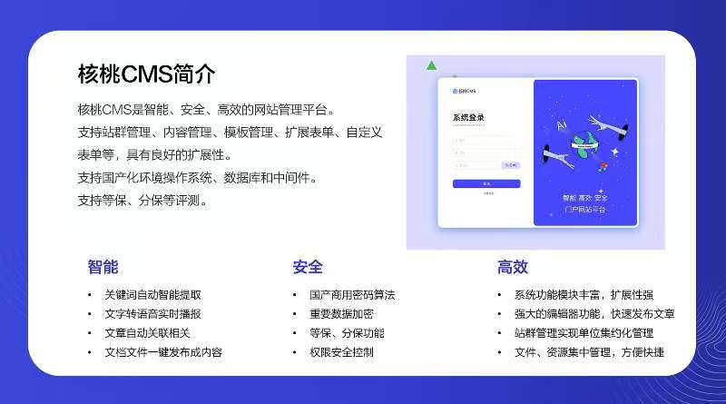

   

# 简介：
核桃CMS是一款基于SpringBoot2架构的JAVA网站建设平台，主要特点是支持涉密信息系统分级保护功能、支持国产化环境、支持数据库和中间件、支持等保二、等保三级、提供全文搜索引擎、支持多级审批、支持动静混合模式、支持站群管理、内容管理、模版管理，能够更好的适配涉密信息系统及内部网站建设需求。

   

# 系统特点
 **智能** 
* 关键词自动智能提取
* 文字转语音实时播报
* 文章自动关联相关
* 文档文件一键发布成内容

 **安全** 
* 国产商用密码算法
* 重要数据加密
* 等保、分保功能
* 权限安全控制

 **高效** 
* 系统功能模块丰富，扩展性强
* 强大的编辑器功能，快速发布文章
* 站群管理实现单位集约化管理
* 文件、资源集中管理，方便快捷

# 技术架构：
基于SpringBoot 2架构，前端基于vue、element ui，是一款安全、可靠、稳定的网站建设平台，已经在多家央企、部委部署使用。

# 运行环境：
核桃CMS支持全系列JAVA运行环境，包括国产操作系统、中间件、数据库。操作系统支持：中标麒麟、银河麒麟、统信、Windows、Linux、Unix；中间件支持：东方通 、宝兰德、Tomcat；数据库支持：Mysql、达梦、人大金仓、神通、南大通用、瀚高 等国产数据库；

# 适用范围
* 公司/集团/政府门户网站
* 个人网址
* 图片展示类
* 快速的二次开发

# 功能特点：
核桃CMS除了具备站点管理、栏目管理、内容管理、审批管理、模板管理、组织管理、权限管理、会员管理、评论管理、留言管理、多渠道管理（微信、微博）等基础功能外，还支持涉密系统分级保护功能、等级保护功能，具备三员管理、三员审核、密级管理、人员密级设定、内容密级设定、附件密级设定、日志分类分级、日志统计、日志告警、日志策略、账户安全管理、双因子设置等功能。

# 系统配置
* 站点配置
* 模版配置
* 消息配置
* 邮件配置
* 支付配置

# 系统部署

# 后台部署

1.环境说明
工具		版本		备注
JDK			1.8	
Maven		3.5+		强制要求
MySQL		5.7.8 +		强制要求
Redis		3.2 +		强制要求

2.开发工具
IDEA

3.编译命令
maven clean
maven install

4.安装教程
新建mysql数据库cursor_cms，导入SQL脚本V1.0.0__Init_Schema.sql.sql。
Mysql版本为5.7，字符集选择utf8mb4，排序规则选择utf8mb4_general_ci。

5.运行jar包
编译打包后端工程，运行java -jar cursor-cms-api-1.0-SNAPSHOT.jar。

# 前端部署

1.环境说明
工具	版本	备注
Node	14	

2.开发工具

WebStorm或VsCode

3.命令
安装依赖：npm install
启动服务：npm run serve
打包：npm run build

4.访问
打开http://localhost:8222 访问登录页面,账号admin密码是123456。
# 功能模块

   

 **安全设置** 
* 权限设置
* 角色管理
* 用户管理
* 双因子设置
* 分级保护
* 日志管理
* 三员管理
* 密级设置

 **内容管理** 
* 站点管理
* 搜索管理
* 栏目管理
* 文章管理
* 审批管理
* 一键发布
* 智能提取
* 扩展管理
* 流程管理
* 语音转换
* 模版管理

 **系统设置** 
* 账户安全配置
* 计划任务
* 资源管理
* 通知管理
* 运行监控
* 统计分析

搜索（https://htyun.net/html/web/news/productnew/1789134887482904577.html）“核桃云官网”，了解系统详情。

# 联系我们

**扫描下方二维码，欢迎咨询** 

   

